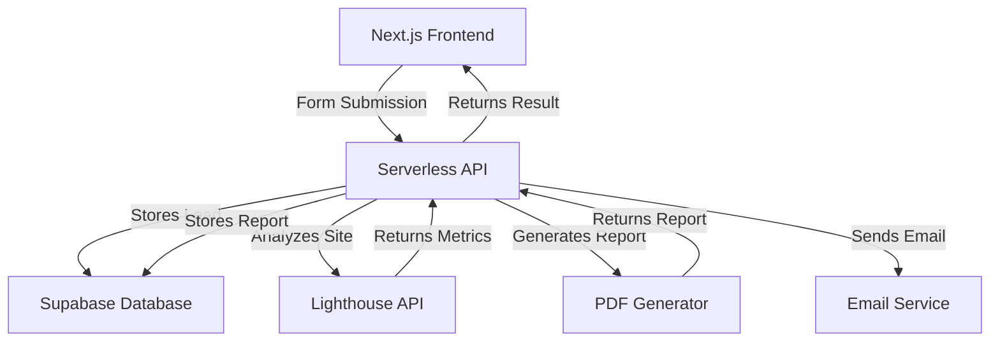
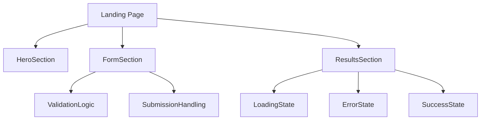
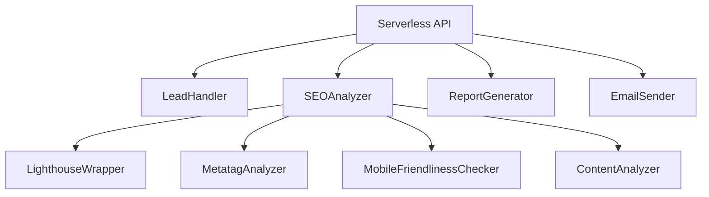

# System Patterns: Minimalist SEO Report Generator

## Architecture Overview

The SEO Report Generator follows a simple, serverless architecture:

## Component Architecture

### Frontend Components

### Backend Components

## Key Design Patterns

### Frontend

1. **Single Page Application (SPA)**
   - Uses Next.js for server-side rendering and simple API routes
   - Maintains all functionality on a single page with state transitions

2. **Component-Based Design**
   - Modular components for form, results display, and loading states
   - Shared UI components for consistent styling

3. **Progressive Enhancement**
   - Core functionality works without JavaScript
   - Enhanced experience with client-side transitions and animations

4. **Responsive Design**
   - Mobile-first approach ensuring full functionality on all devices
   - Fluid layout that adapts to different screen sizes

### Backend

1. **Serverless Architecture**
   - API routes implemented as serverless functions
   - No persistent server needed, scales automatically

2. **Service-Oriented Architecture**
   - Separate services for SEO analysis, report generation, and email delivery
   - Clear separation of concerns

3. **Asynchronous Processing**
   - Non-blocking operations for improved performance
   - Parallel processing where possible (e.g., running multiple checks simultaneously)

4. **Caching Strategy**
   - Cache SEO analysis results to speed up repeat requests
   - Intelligent throttling to respect API limits

## Data Flow

1. **User Input Capture**
   - Form validates input fields client-side
   - Submission sends data to API endpoint

2. **SEO Analysis Process**
   - API receives URL and triggers analysis
   - Lighthouse and other tools analyze the website
   - Results compiled into structured format

3. **Report Generation**
   - Analysis results formatted into readable report
   - PDF generated with branded styling

4. **Lead Management**
   - User details stored in database
   - Email sent with report or access link

5. **Results Delivery**
   - Success notification shown to user
   - Option to view report immediately or access via email 